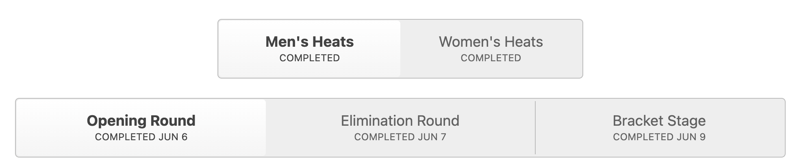

# WSL Analysis

This repository contains Python scripts to pull, model & analysis World Surf League (WSL) data. The data is pulled directly from WSL's website, modelled and stored in a SQLite database (TODO). There isn't much analysis on surf data on the web so I thought it would be interesting to see what insights can be drawn from the data.

## Scraper

The scraper is using the Requests library and BeautifulSoup to pull data from the WSL website. As we using requests it's difficult to get all the data we want as the website is using JavaScript to load some data but further down the line we can look at using Playwright to get around this.

### Loading Event Pages

The first step to getting the data is to load each Surf events page. The URL's follow a fairly consistent format

```
https://www.worldsurfleague.com/events/{year}/{tour_code}/{event_id}/{event_name}/results
```

Here's a breakdown of each component:

- `https://www.worldsurfleague.com/events/`: This is the base URL for all World Surf League events.
- `{year}`: This is the year of the event. For example, `2024`.
- `{tour_code}`: This is the code for the tour. For example, `ct` for Championship Tour.
- `{event_id}`: This is the unique identifier for the event. For example, `202`.
- `{event_name}`: This is the name of the event, with spaces replaced by hyphens. For example, `surf-city-el-salvador-pro`.
- `/results`: This is the page for the results of the event.

So, for example, the URL for the Surf City El Salvador Pro event in 2024 on the Championship Tour would be:

```
https://www.worldsurfleague.com/events/2024/ct/202/surf-city-el-salvador-pro/results
```

I actually found that some portions of the URL didn't make too much of a difference. For example, the following URL also works:

```
https://www.worldsurfleague.com/events/0000/ANYTHING/4458/results
```

This highlights that the underlying `event_id` is the most important part of the URL.

Now we could fairly easily set a loop to go through all the events avaialble on the website, however some of the older events and other tours have a different website structure. For now the scope is just on the Championship Tour, so we will take a different approach to build our list of event page URLs.

### Building list of event URLs

This page lists all the events for the current year:

```
https://www.worldsurfleague.com/events/2024/ct?all=1
```

Honestly, the fastest way would be just to copy and paste the URLs :), however, nice to practice coding and should our scope go beyond the Championship Tour, it will be faster to have a script to pull the URLs.

The `get_links.py` script pulls the event URLs from the page and writes them to a csv file.

1. It opens the page
2. Finds all the event elements
3. Parse the event elements into an Event object
4. Write the Event objects to a csv file

### Parsing Event Pages

#### Round Links

Now the meat of the scraper :) The `app.py` script will load each of the event pages. Before we can scrape the data we need to build each of the round urls for the event.

When you first load the page, it will initially show the Men's Opening Round heats. In the image below there are buttons to navigate to the other rounds and the Women's heats.



Each of these buttons have their own unique URL, so we store each of these URLS in a list then loop through each of them to get the data.

#### Heat Cards

The opening & elimination rounds have cards that look like this:


The cards contain the information for each competitor in the heat, their total score and their combined two wave score. The card itself contains further information about the round, such as the round number and the heat number.

#### Bracket Cards

The "final day" rounds show a bracket structure instead.


These cards provide mostly the same information as the heat cards, but we aren't able to get the individual wave scores for each competitor.

#### Heat Details

We can get much more detailed information about each heat by clicking on the heat card. This will open a modal with the heat details.


There isn't a url for any obvious information shown in the network tab when loading the modal, so for now we will ignore this data until we are ready to use Playwright to get the data.

### Data Model

For intial storage of the data we are using a wide table format. Each row will correspond to a single competitor in a single heat. It will also contain all the event information, such as the event name, the round number, the heat number, etc. This will mean a lot of duplicate data stored initially but we will later model it into a more normalized form.

We will store each of the event pages in a separate csv file for each sex. The csv files will be named `{tour_code}_{event_id}_heat_data.csv`.
